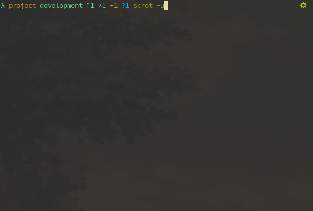

# lambda-blazinggit
An Oh-My-Zsh theme with blazing fast, detailed git information.

## Requires
1. [zsh](https://www.zsh.org/)
2. [Oh My Zsh](https://github.com/ohmyzsh/ohmyzsh)
3. [gitstatus](https://github.com/romkatv/gitstatus) zsh plugin
4. A terminal emulator with [NerdFonts](https://www.nerdfonts.com/)

## How to Install
1. Clone the project `cd ~/.oh-my-zsh/custom/themes && git clone https://github.com/zalefin/lambda-blazinggit.git`
2. Ensure you have the [gitstatus](https://github.com/romkatv/gitstatus) installed and
`plugins=( gitstatus ... )` set in your `.zshrc` file.
3. Set `ZSH_THEME="lambda-blazinggit/lambda-blazinggit"` in your `.zshrc`

